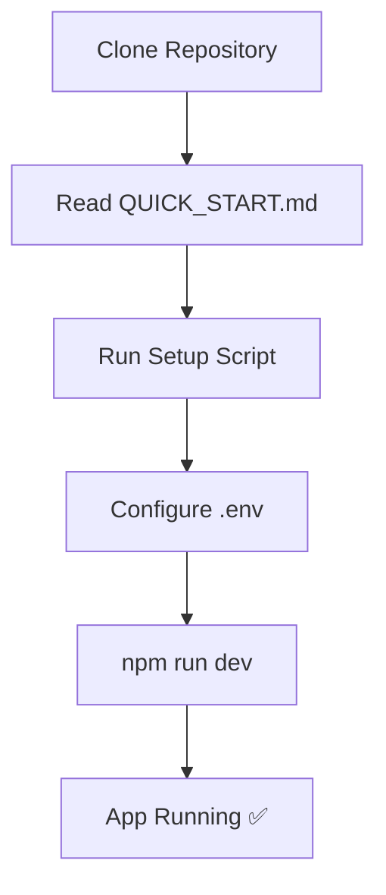
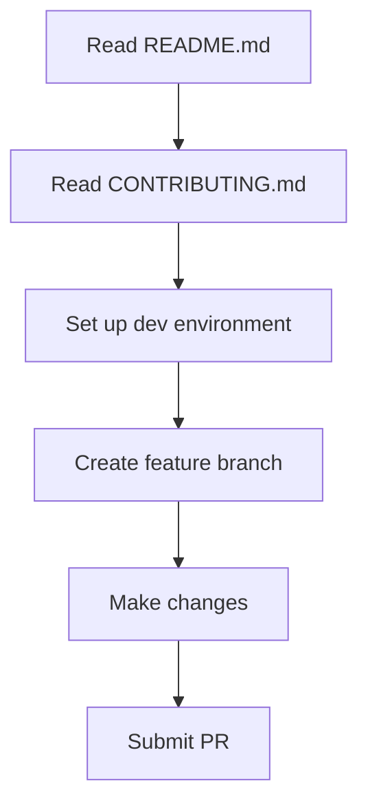

# 📚 DSMS Documentation Index

Welcome to the Disease Surveillance Management System documentation! This guide will help you navigate all available documentation.

## 📖 Documentation Overview

### For New Users

| Document | Description | Time to Read |
|----------|-------------|--------------|
| [QUICK_START.md](./QUICK_START.md) | Get running in 5 minutes | ⏱️ 5 min |
| [README.md](./README.md) | Project overview and features | ⏱️ 10 min |
| [SETUP.md](./SETUP.md) | Detailed setup instructions | ⏱️ 15 min |

### For Developers

| Document | Description | When to Use |
|----------|-------------|-------------|
| [CONTRIBUTING.md](./CONTRIBUTING.md) | Contribution guidelines | Before making changes |
| [diseases.md](./diseases.md) | Disease data reference | Understanding disease schema |

### Configuration Files

| File | Purpose | Required |
|------|---------|----------|
| `.env.example` | Environment variable template | ✅ Yes |
| `package.json` | Dependencies and scripts | ✅ Yes |
| `prisma/schema.prisma` | Database schema | ✅ Yes |

### Setup Scripts

| Script | Platform | Usage |
|--------|----------|-------|
| `setup.sh` | Mac/Linux | `bash setup.sh` |
| `setup.ps1` | Windows | `.\setup.ps1` |

---

## 🚀 Quick Navigation

### I want to...

#### ...get started quickly
→ Go to [QUICK_START.md](./QUICK_START.md)

#### ...understand the project
→ Read [README.md](./README.md)

#### ...set up for production
→ See [SETUP.md#production-deployment](./SETUP.md#production-deployment)

#### ...contribute code
→ Follow [CONTRIBUTING.md](./CONTRIBUTING.md)

#### ...troubleshoot issues
→ Check [SETUP.md#troubleshooting](./SETUP.md#troubleshooting)

#### ...understand the database
→ View `prisma/schema.prisma` or run `npm run prisma:studio`

---

## 📊 Documentation Structure

```
dengue/
├── 📄 README.md           # Main project documentation
├── ⚡ QUICK_START.md      # 5-minute setup guide
├── 🔧 SETUP.md            # Detailed setup instructions
├── 🤝 CONTRIBUTING.md     # Contribution guidelines
├── 📚 DOCUMENTATION.md    # This file - navigation guide
├── 🦟 diseases.md         # Disease reference data
├── 🔐 .env.example        # Environment template
├── 🚀 setup.sh            # Auto-setup (Mac/Linux)
└── 🚀 setup.ps1           # Auto-setup (Windows)
```

---

## 🎯 Getting Started Flow

### For First-Time Setup:



**Step-by-step:**

1. **Clone** the repository
2. **Read** [QUICK_START.md](./QUICK_START.md)
3. **Run** setup script:
   - Windows: `.\setup.ps1`
   - Mac/Linux: `bash setup.sh`
4. **Configure** `.env` file
5. **Start** development: `npm run dev`

### For Contributors:



---

## 📋 Key Concepts

### Project Architecture

- **Framework**: Next.js 15 (App Router)
- **Database**: MySQL with Prisma ORM
- **Styling**: Tailwind CSS
- **Real-time**: Socket.io
- **Auth**: JWT + bcryptjs

### Core Features

1. **Disease Reporting** - Anonymous public reporting
2. **Real-time Alerts** - Socket.io based notifications
3. **Geospatial Mapping** - Leaflet/Mapbox integration
4. **Analytics Dashboard** - Data visualization
5. **Role-Based Access** - Admin, Health Worker, Researcher, Public

### Responsive Design

- Mobile-first approach
- Breakpoints: 320px, 768px, 1024px+
- Touch-friendly (44px minimum)
- Adaptive layouts

---

## 🔗 External Resources

### Official Documentation

- [Next.js Docs](https://nextjs.org/docs) - Framework
- [Prisma Docs](https://www.prisma.io/docs) - Database ORM
- [Tailwind CSS](https://tailwindcss.com/docs) - Styling
- [TypeScript](https://www.typescriptlang.org/docs/) - Language

### Learning Resources

- [Next.js Tutorial](https://nextjs.org/learn)
- [Prisma Quickstart](https://www.prisma.io/docs/getting-started)
- [React Docs](https://react.dev/)

### Tools

- [Prisma Studio](https://www.prisma.io/studio) - Database GUI (`npm run prisma:studio`)
- [Chrome DevTools](https://developer.chrome.com/docs/devtools/) - Debugging
- [VS Code](https://code.visualstudio.com/) - Recommended editor

---

## 🆘 Support & Help

### Documentation

1. Check [QUICK_START.md](./QUICK_START.md) for quick fixes
2. Read [SETUP.md](./SETUP.md) troubleshooting section
3. Review [CONTRIBUTING.md](./CONTRIBUTING.md) for guidelines

### Community

- 💬 [GitHub Discussions](../../discussions) - Ask questions
- 🐛 [Issues](../../issues) - Report bugs
- 📧 Email: support@dsms.gov

### Common Issues

| Issue | Solution |
|-------|----------|
| Port in use | [QUICK_START.md#port-3000-already-in-use](./QUICK_START.md#port-3000-already-in-use) |
| Database error | [SETUP.md#database-connection-failed](./SETUP.md#database-connection-failed) |
| Module not found | [QUICK_START.md#module-not-found-errors](./QUICK_START.md#module-not-found-errors) |
| Prisma errors | [SETUP.md#prisma-migration-errors](./SETUP.md#prisma-migration-errors) |

---

## 📝 Documentation Updates

This documentation is regularly updated. Last major update: **October 2025**

### Contributing to Docs

Found an error or want to improve documentation?

1. Edit the relevant `.md` file
2. Follow [CONTRIBUTING.md](./CONTRIBUTING.md) guidelines
3. Submit a pull request with `docs:` prefix

Example:
```bash
git commit -m "docs(setup): add MySQL 9.0 support"
```

---

## ✅ Quick Checklist

Before asking for help, make sure you:

- [ ] Read [QUICK_START.md](./QUICK_START.md)
- [ ] Checked [SETUP.md](./SETUP.md) troubleshooting
- [ ] Verified Node.js 18+ is installed
- [ ] Confirmed MySQL 8+ is running
- [ ] Configured `.env` correctly
- [ ] Ran `npm install`
- [ ] Ran database migrations
- [ ] Searched existing issues

---

## 🎉 You're Ready!

Choose your path:

- 🚀 **Quick Setup**: [QUICK_START.md](./QUICK_START.md)
- 📖 **Learn More**: [README.md](./README.md)
- 🔧 **Detailed Setup**: [SETUP.md](./SETUP.md)
- 🤝 **Contribute**: [CONTRIBUTING.md](./CONTRIBUTING.md)

**Happy coding! 💚**

---

*Disease Surveillance Management System - Ministry of Health*

